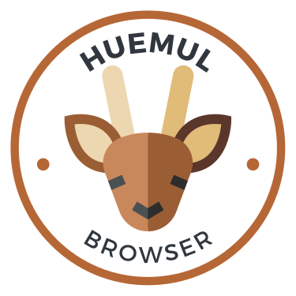

# Huemul Browser

It is a simple web browser that can be used to browse the web. It is based on the [Chromium](https://www.chromium.org/Home) browser. It is written
in [Python](https://www.python.org/) using [PyQt6](https://www.riverbankcomputing.com/software/pyqt).

Project currently is in **development**, but it is working.

## Contributing

We would be pleased to receive a contribution from you, open a pull request and we will review it as soon as possible.